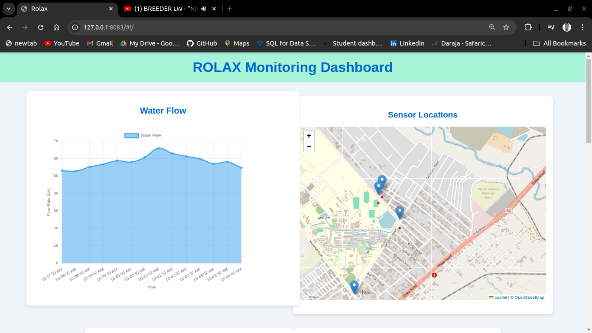
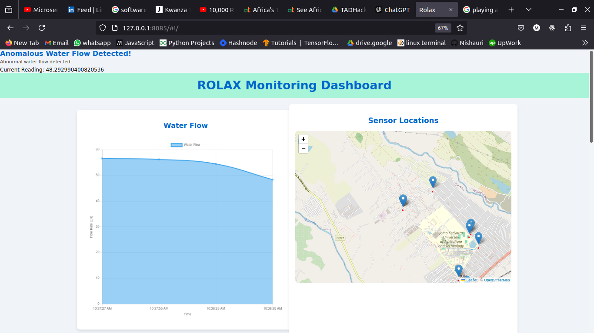
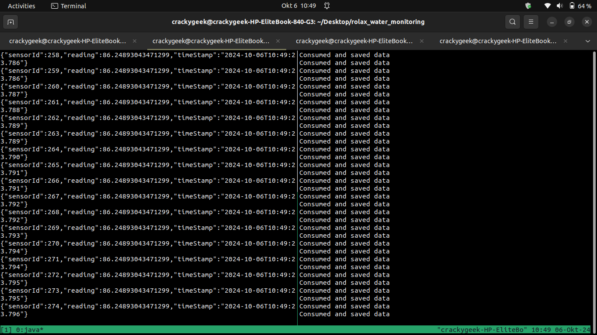

# Rolax Water Monitoring

## Description

This project is a web-based platform designed for the real-time monitoring of water distribution networks, equipped with advanced features like map visualization, anomaly detection, and automated alerts. Leveraging IoT sensors, Apache Kafka for scalable streaming, and SMS integration, the system ensures efficient management of water resources for distribution companies and other stakeholders, including in areas with limited internet access.

The project has 4 microservices:  

- **Backend :**

>- [Data Collection](https://github.com/Mburu-Elvis/Rolax_Water_Monitoring/tree/main/data_collection)  
Simulates data streaming from the sensors and publishes to Apache Kafka cluster
>- [Data Ingestion](https://github.com/Mburu-Elvis/Rolax_Water_Monitoring/tree/main/dataIngestion)  
Subscribes to the Apache Kafka cluster and processes the data and persists the data to the database
>- [Portal Backend](https://github.com/Mburu-Elvis/Rolax_Water_Monitoring/tree/main/portal_backend)  
Processes and prepares data for the portal to consume such as sensor readings aggregates and sensor locations

- **Frontend :**  
[Portal](https://github.com/Mburu-Elvis/Rolax_Water_Monitoring/tree/main/portal)  
Visualizes the data for monitoring and also displays the various sensors locations on a map

## Table of Contents

- [Features](#features)
- [Contributing](#contributing)
- [License](#license)

## Features

### Web Interface for Monitoring

[Microservice](https://github.com/Mburu-Elvis/Rolax_Water_Monitoring/tree/main/portal)

A user-friendly web dashboard that provides real-time insights into water flow, sensor data, and network health, enabling stakeholders to monitor the entire water distribution system from a single interface.

#### Map Visualization of Sensor Locations

Visualize the locations of IoT sensors (meters and water flow sensors) on a map, allowing users to easily track the flow of water across different regions. This feature also highlights areas where anomalies, such as leaks, are detected, helping users quickly identify and address issues.

#### Real-Time Anomaly Detection & Alerts

The system continuously monitors data streams from the sensors and automatically detects anomalies (e.g., leaks, irregular flow). When an issue is detected or reported via the SMS channel, alerts are immediately generated and sent to stakeholders via SMS, or through the web interface, allowing for quick response and resolution.

#### Scalable Streaming Architecture

Powered by Apache Kafka, the platform ensures scalability, allowing it to efficiently handle high volumes of sensor data from distributed networks. This ensures that the system can grow alongside expanding water networks without performance degradation.

#### USSD and SMS Integration

[microservice](https://github.com/Mburu-Elvis/rolax_ussd)

In areas with limited or no internet access, the system supports interaction through USSD and SMS, enabling users to report issues and receive updates via mobile phones.

## Use Case & Benefits

### Efficient Water Management

Optimize water usage by providing real-time data on water flow, identifying leaks quickly, and preventing water loss.

### Improved Decision-Making

Visualize water distribution data on a map and receive real-time alerts, helping distribution companies make data-driven decisions on resource allocation and network maintenance.

### Broad Accessibility

The inclusion of USSD and SMS-based alerts ensures that even users in regions with poor internet connectivity can participate in water monitoring and receive timely updates

## Technologies Used

- **Java, Springboot :** Backend
- **Apache Kafka :** Data stream processing
- **MySQL :** Database
- **AngularJs :** Frontend

## Contributing

## License
